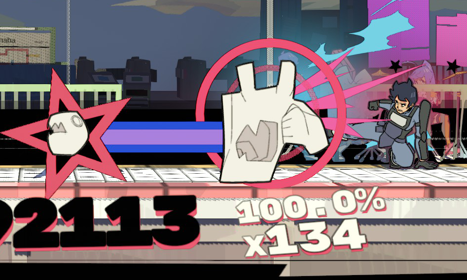

# Custom Characters

This mod for UNBEATABLE allows you to add fully custom characters in the arcade mode, including custom animations and multiple attacks.

## Compatible game versions

- UNBEATABLE (tested with `v1.6.1`)

## Requirements

- [BepInEx](https://github.com/BepInEx/BepInEx)

## Installation

1. Download and install BepInEx into your game directory (if you use [CustomBeatmaps](https://github.com/unbeatable-modding/CustomBeatmapsV5), you have this installed already)
2. Run the game, then close it
3. [Download this mod](https://github.com/Zachava96/CustomCharacters/releases)
4. Merge the BepInEx folder from this mod with the BepInEx folder in your game directory
5. (Optional) Add additional characters into your `UNBEATABLE/BepInEx/plugins/CustomCharacters` folder.
5. Run the game

## How do I make my own custom characters?

Refer to [Making Custom Characters.](<Making Custom Characters.md>)